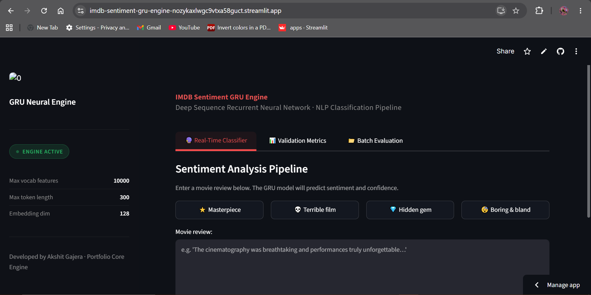
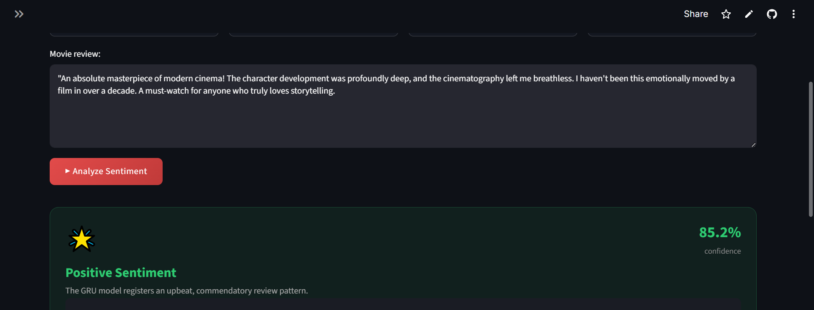
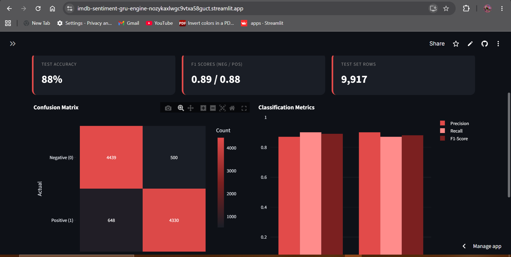

# 🎬 IMDB Sentiment Analysis Engine

### Deep Learning Powered Movie Review Classification using RNN, LSTM & GRU

---

## 🚀 Live Demo

### 🌐 Deployment

https://imdb-sentiment-gru-engine-nozykaxlwgc9vtxa58guct.streamlit.app/

---

## 📌 Project Overview

IMDB Sentiment Analysis Engine is a production-ready NLP dashboard that predicts whether a movie review expresses a **Positive** or **Negative** sentiment.

The project explores and compares three popular Recurrent Neural Network architectures:

* Simple RNN
* LSTM (Long Short-Term Memory)
* GRU (Gated Recurrent Unit)

After experimentation, the **GRU model achieved the best balance between performance, convergence speed, and generalization**, making it the final deployed model.

The application provides:

* Real-time sentiment prediction
* Confidence score estimation
* Batch review processing
* Model evaluation dashboard
* Downloadable prediction results

---

## 🧠 Problem Statement

Movie reviews contain rich textual information that reflects user sentiment.

Traditional machine learning models struggle to capture long-term dependencies in text sequences.

To solve this problem, Recurrent Neural Networks were explored and compared to identify the most effective architecture for sentiment classification.

---

## 📊 Dataset Information

### IMDB Large Movie Review Dataset

The dataset contains highly polarized movie reviews.

| Attribute    | Description         |
| ------------ | ------------------- |
| Feature      | Review Text         |
| Target       | Sentiment           |
| Classes      | Positive / Negative |
| Dataset Size | 50,000 Reviews      |

### Target Encoding

| Sentiment | Label |
| --------- | ----- |
| Negative  | 0     |
| Positive  | 1     |

---

## 🔧 NLP Preprocessing Pipeline

The following preprocessing steps were applied:

### Text Cleaning

* Convert text to lowercase
* Remove HTML tags
* Remove URLs
* Remove punctuation

### NLP Processing

* Tokenization
* Stopword Removal
* Lemmatization

### Sequence Preparation

* Keras Tokenizer
* Vocabulary Size: 10,000
* Sequence Padding
* Maximum Sequence Length: 300

---

## 🏗️ Deep Learning Architecture Comparison

Three sequence models were trained and evaluated:

### 1️⃣ Simple RNN

Embedding Layer
↓
SimpleRNN(64)
↓
Dropout(0.2)
↓
Dense(1, Sigmoid)

---

### 2️⃣ LSTM

Embedding Layer
↓
LSTM(64)
↓
Dropout(0.2)
↓
Dense(1, Sigmoid)

---

### 3️⃣ GRU (Final Model)

Embedding Layer
↓
GRU(64)
↓
Dropout(0.2)
↓
Dense(1, Sigmoid)

---

## 🏆 Why GRU Was Selected

During experimentation:

✅ Faster training

✅ Lower computational cost

✅ Better convergence

✅ Strong generalization capability

✅ Best validation performance

Therefore, the GRU model was selected as the production model and deployed through Streamlit.

---

## ⚙️ Hyperparameters

| Parameter           | Value               |
| ------------------- | ------------------- |
| Vocabulary Size     | 10,000              |
| Embedding Dimension | 128                 |
| Sequence Length     | 300                 |
| RNN Units           | 64                  |
| Dropout             | 0.2                 |
| Batch Size          | 64                  |
| Epochs              | 5                   |
| Optimizer           | Adam                |
| Loss Function       | Binary Crossentropy |

---

## 📈 Model Performance

### Final GRU Model

| Metric    | Score |
| --------- | ----- |
| Accuracy  | 88%   |
| Precision | 90%   |
| Recall    | 87%   |
| F1 Score  | 88%   |

The model was evaluated on approximately 10,000 unseen movie reviews.

---

## 🎯 Features

### 🔮 Real-Time Prediction

Enter a movie review and instantly obtain:

* Predicted Sentiment
* Confidence Score
* Probability Distribution

---

### 📊 Evaluation Dashboard

Includes:

* Confusion Matrix
* Classification Report
* Performance Metrics

---

### 📁 Batch Prediction

Upload:

* CSV Files
* Excel Files

Generate sentiment predictions for hundreds of reviews simultaneously.

---

## 🖼️ Application Screenshots

### Dashboard Home

### Prediction Interface

### Analytics Dashboard

---

## 📂 Project Structure

IMDB-Sentiment-GRU-Engine

├── app.py
├── best_gru_model.keras
├── tokenizer.pkl
├── model_config.pkl
├── images/
├── requirements.txt
└── README.md

---

## 🛠️ Technology Stack

### Programming

* Python

### Deep Learning

* TensorFlow
* Keras

### NLP

* NLTK

### Data Processing

* NumPy
* Pandas

### Visualization

* Matplotlib
* Seaborn

### Deployment

* Streamlit Cloud

---

## 🚀 Installation

### Clone Repository

git clone https://github.com/akshitgajera1013/IMDB-Sentiment-GRU-Engine.git

cd IMDB-Sentiment-GRU-Engine

### Create Virtual Environment

python -m venv env

### Activate Environment

Windows

env\Scripts\activate

Mac/Linux

source env/bin/activate

### Install Dependencies

pip install -r requirements.txt

### Run Application

streamlit run app.py

---

## 🔮 Future Improvements

* Bidirectional GRU
* Attention Mechanism
* Transformer-based Models (BERT)
* Explainable AI Dashboard
* Multi-class Emotion Classification
* Docker Deployment
* CI/CD Integration

---

## 👨‍💻 Author

### Akshit Gajera

Data Science & Machine Learning Enthusiast

GitHub:
https://github.com/akshitgajera1013

---

⭐ If you found this project useful, don't forget to star the repository.
